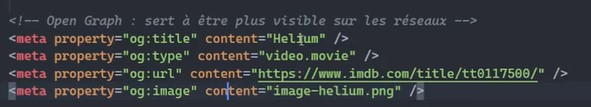

#SEO(Search Enging Optimisation) par google
===========================================

##Référencement Naturel gratuit
-------------------------------

1 - Créer du bon contenu

       - 400 mots/page minimum obligatoire.
       - Garder un site à jour (les robots de google référenceront moins bien un site qui a l'air abandonné)!
       - Insérer les mots clés c'est bien, répéter indéfiniment c'est spamer et on risque de se faire blacklister par google!
       - Ne pas mettre de page d'introduction avant la page principale! Exemple : énorme pub, avec un bouton "accéder au site".
       - Pas de lien 'cliquez ici" où "en savoir plus", les liens doivent être descriptifs du contenu. 
       - Penser à être local (pays, ville, région, quartier,...)
       Le robot de google privilégie les choses locale

2 - HTML "seo fiendly"

       - Changez la langue dans le head 'en' en 'fr' par exemple.
       - la balise title du head supporte jusqu'à 70 caractères, plus c'est précis et bien détaillés, mieux sera le référencement.
       - méta name="description" content="", dans le head faire une phrace ultra précise(texte qui apparait sous le titre pour 
         expliquer le contenu).
       - opengraph sert à être plus visible sur les réseaux.(méta property="" content="") Il peut y en avoir plusieurs. 
       
       https://cards-dev.twitter.com/validator //attention\\ remplacer twitter par X 

       https://ogp.me

       - title et méta apparaissent dans les résultats de recherche google.
       

3 - Site rapide (performant)

        - le h1 doit être le plus possible et décrire de quoi on parle
        - mettre des mots en balise 'strong' et où 'em'
        - alt pertinent et bien détaillés
        - l'image doit être optimisé dans sa taille et son format(ex. ne doit pas dépasser de son contenat)
        - robots.txt [chemin d'accès vers](./robots.txt)